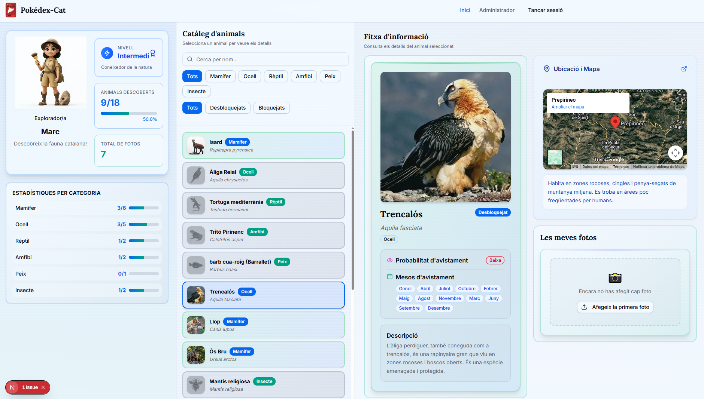
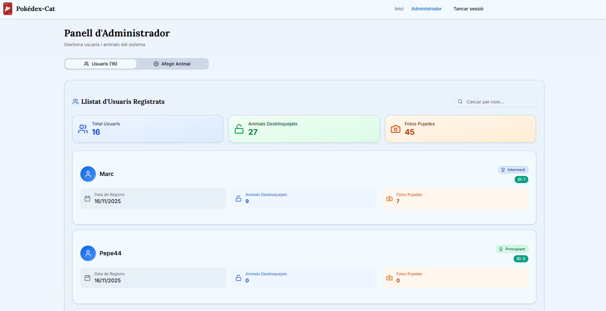
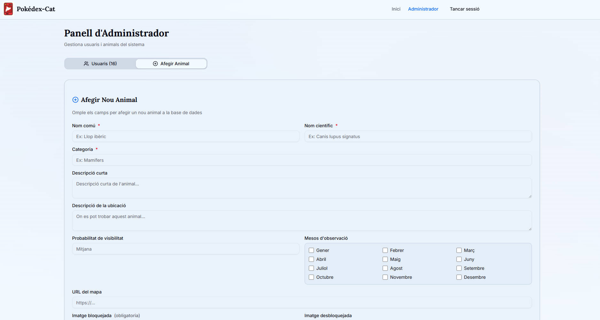

# Pokédex-Cat (Frontend)

A modern Next.js application for cataloging and discovering native animals of Catalonia, inspired by the Pokédex concept. Users can unlock animals by uploading photos, track their progress, and compete with friends to complete their collection.


## 🌟 Features

### User Features
- **Animal Discovery**: Browse through a comprehensive catalog of Catalan fauna
- **Interactive Unlocking System**: Unlock animals by uploading real photos
- **Personal Progress Tracking**: Monitor your collection completion with detailed statistics
- **Category-based Organization**: Animals organized by categories (Mammals, Birds, Reptiles, etc.)
- **Advanced Filtering**: Search and filter by name, category, and unlock status
- **Photo Gallery**: View and manage your uploaded animal photos
- **Character Customization**: Choose your explorer avatar
- **Monthly Visibility**: Track which months animals can be spotted
- **Location Information**: Interactive maps showing where to find each animal




### Admin Features
- **User Management**: View all registered users and their statistics
- **Animal Creation**: Add new animals to the catalog with detailed information
- **Statistics Dashboard**: Monitor platform usage and engagement




## 🛠️ Tech Stack

- **Framework**: Next.js 16 (App Router)
- **Language**: TypeScript
- **Styling**: Tailwind CSS v4
- **UI Components**: Radix UI + shadcn/ui
- **Forms**: React Hook Form + Zod validation
- **State Management**: React Context API
- **Icons**: Lucide React
- **Date Handling**: date-fns

## 📋 Prerequisites

- Node.js 18+ 
- npm, yarn, or pnpm
- Backend API running (see [Backend Repository](https://github.com/mxg952/pokedex-animals-catalunya.git))

## 🚀 Getting Started

### Installation

1. **Clone the repository**
   ```
   git clone <your-frontend-repo-url>
   cd pokedex-animals-catalunya-frontend
   ```

2. **Install dependencies**
   ```
   npm install
   ```
   or
   ```
   yarn install
   ```
   or
   ```
   pnpm install
   ```
   

3. **Configure environment variables**
   
   Create a `.env.local` file in the root directory:
   ```
   NEXT_PUBLIC_API_URL=http://localhost:8080
   ```

   Replace `http://localhost:8080` with your backend API URL.

4. **Run the development server**
   ```
   npm run dev
   ```
   # or
   ```
   yarn dev
   ```
   # or
   ```
   pnpm dev
   ```

5. **Open your browser**
   
   Navigate to [http://localhost:3000](http://localhost:3000)

## 🔑 Key Features Explained

### Authentication System
The app uses a custom authentication context (`lib/auth-context.tsx`) that manages user sessions and role-based access control. Users can be either regular users or admins.

### Animal Unlocking Flow
1. User selects a locked animal from the catalog
2. Opens the unlock modal
3. Uploads a photo and optional description
4. Backend validates the photo
5. Animal is unlocked and added to user's collection

### Progress Tracking
Users can track:
- Total animals unlocked vs. total available
- Photos uploaded
- Category-specific completion rates
- User level (Beginner, Intermediate, Expert)

### Admin Dashboard
Admins have access to:
- Complete user list with statistics
- Animal creation form with image upload
- Platform-wide statistics
- User activity monitoring

## 🌐 Backend Integration

This frontend connects to a Spring Boot backend. The backend repository can be found at:

**[https://github.com/mxg952/pokedex-animals-catalunya.git](https://github.com/mxg952/pokedex-animals-catalunya.git)**

### API Endpoints

#### User Controller
- `POST /api/users/register` - Register a new user
- `POST /api/users/login` - User login
- `POST /api/users/logout` - User logout

#### Admin Controller
- `GET /api/admin/users` - Get all users (admin only)
- `GET /api/admin/stats` - Get platform statistics (admin only)
- `POST /api/admin/animals` - Create new animal (admin only)

#### Animal Controller
- `GET /api/animals/get` - Fetch all animals in the catalog
- `GET /api/animals/search` - Search animals by name or category
- `GET /api/animals/{id}/unlocked` - Check if a specific animal is unlocked by the user

#### User Animal Controller
- `GET /api/user-animals/get` - Fetch user's animal collection
- `POST /api/user-animals/unlock` - Unlock an animal by uploading a photo
- `POST /api/user-animals/{animalId}/photos` - Add additional photos to an unlocked animal
- `PUT /api/user-animals/photos/{photoId}` - Update an existing photo
- `DELETE /api/user-animals/photos/{photoId}` - Delete a photo
- `GET /api/user-animals/{photoId}/download` - Download a specific photo
#### Animal Image Controller
- `GET /api/images/animals/{type}/{filename}` - Get animal catalog images
- `GET /api/images/user-animals/{filename}` - Get user-uploaded animal photos

## 🎨 Design System

The app uses a Pokédex-inspired design with:
- **Primary Color**: Purple (#6366f1)
- **Secondary Color**: Teal/Cyan
- **Accent Color**: Pink (#ec4899)
- **Fonts**: Inter (sans-serif), Lora (serif)
- **Border Radius**: 0.75rem (rounded-lg)

### Theme Support
The app supports both light and dark modes with carefully crafted color tokens defined in `app/globals.css`.


## 🔒 Environment Variables

| Variable | Description | Required |
|----------|-------------|----------|
| `NEXT_PUBLIC_API_URL` | Backend API base URL | Yes |

## 🧪 Development

### Available Scripts

# Development server
```
npm run dev
```

# Production build
```
npm run build
```

# Start production server
```
npm run start
```

# Lint code
```
npm run lint
```

## 🐛 Known Issues

- The API client and types files (`lib/api-client.tsx`, `lib/types.ts`) need to be properly configured with your backend URL
- Ensure CORS is enabled on the backend for frontend requests

## 🚀 Deployment

### Vercel (Recommended)
1. Push your code to GitHub
2. Import project in Vercel
3. Add environment variables
4. Deploy

### Other Platforms
Build the production bundle:
```
npm run build
npm run start
```

## 👥 Contributing

Contact the repository for contribution guidelines.

For issues related to:
- **Frontend**: Create an issue in this repository
- **Backend**: Visit the [backend repository](https://github.com/mxg952/pokedex-animals-catalunya.git)

## 🙏 Acknowledgments

- Inspired by the Pokédex concept from Pokémon
- Built with modern web technologies
- Focused on Catalan fauna education and awareness
